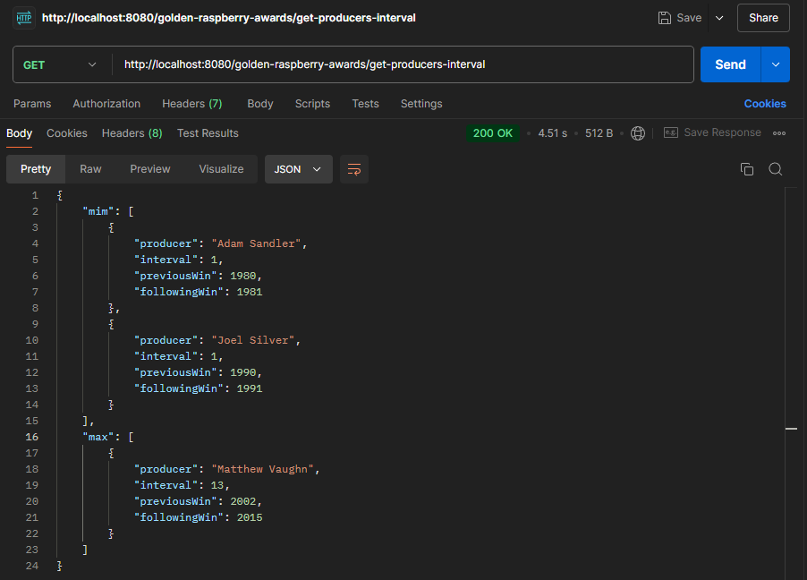
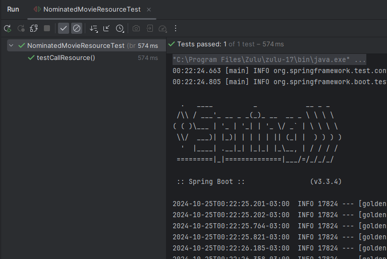

# Golden Raspberry Awards Analytics

## ☘️ Descrição

O projeto realiza a leitura de um CSV na localidade infomada abaixo e salva os dados em um banco H2 ao realizar o start. Após isso temos um endpoint também mencionado abaixo que realiza a busca dos produtores com menor e maior intervalo de premiação, exibindo então o intervalo, nome do produtor, data da primeira premiação e a data da última premiação.

---




> Exemplo do retorno do projeto.

## 💻 Pré-requisitos

Antes de começar, verifique se você atendeu aos seguintes requisitos:

- Você instalou a versão 17 do java
- Você instalou o git

## 🚀 Instalando

Para instalar o projeto basta realizar o clone:

```
git clone https://github.com/lmoreira256/golden-raspberry-awards-analytics.git
```

E realizar a importação do projeto na sua IDE de preferência;

## ☕ Usando

Para utilizar o projeto contem na pasta o arquivo _src > main > resource > data > movies.csv_ que pode ser alterado.

E então realizar o start do projeto na sua IDE, após isso o projeto está pronto para ser utilizado realizando a seguinte chamada cURL:

```
curl --location 'http://localhost:8080/golden-raspberry-awards/get-producers-interval'
```

Caso queira, também é possível acessar o banco de dados H2 utilizando o link:

```
localhost:8080/h2-console/
```

E utilizar as seguintes informações:

```
JDBC URL: jdbc:h2:mem:golden_raspberry_awards_db
User Name: golden_raspberry_awards
Password: golden_raspberry_awards
```

## ⚒️ Testes

O projeto também conta com um teste de integração completo:



## 📫 Contribuindo

Para contribuir com o projeto, siga estas etapas:

1. Bifurque este repositório.
2. Crie um branch: `git checkout -b <nome_branch>`.
3. Faça suas alterações e confirme-as: `git commit -m '<mensagem_commit>'`
4. Envie para o branch original: `git push origin <nome_do_projeto> / <local>`
5. Crie a solicitação de pull.

Como alternativa, consulte a documentação do GitHub em [como criar uma solicitação pull](https://help.github.com/en/github/collaborating-with-issues-and-pull-requests/creating-a-pull-request)
